# Portfolio
## Amazon Web Services

[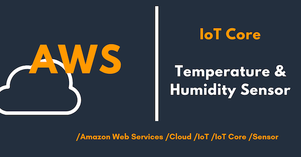](./AWS_IoT_Step1.ipynb)

[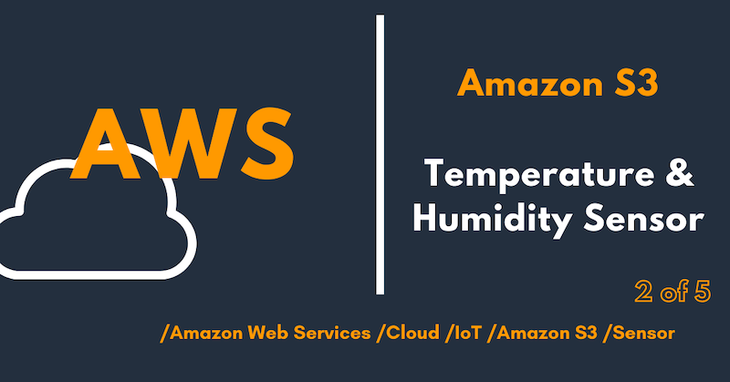](./AWS_IoT_Step2.ipynb)

[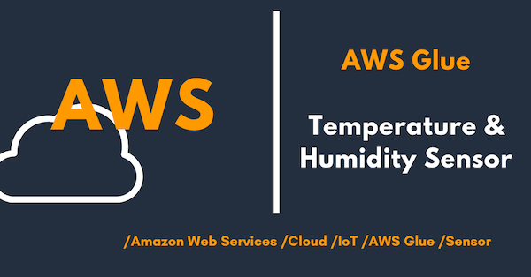](./AWS_IoT_Step3.ipynb)

[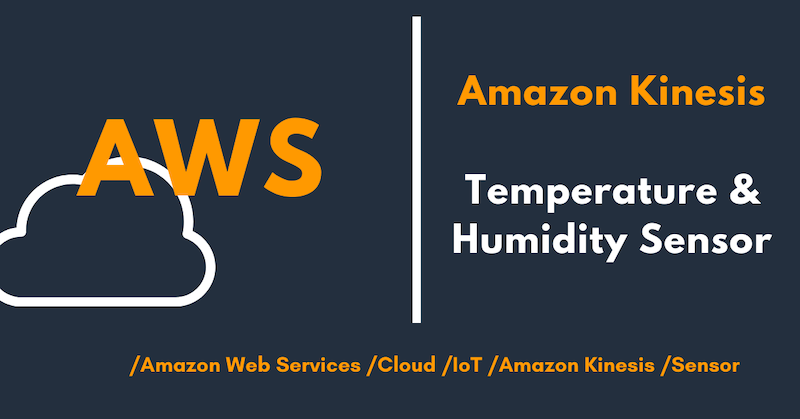](./AWS_IoT_Step4.ipynb)

## Google Cloud Platform

[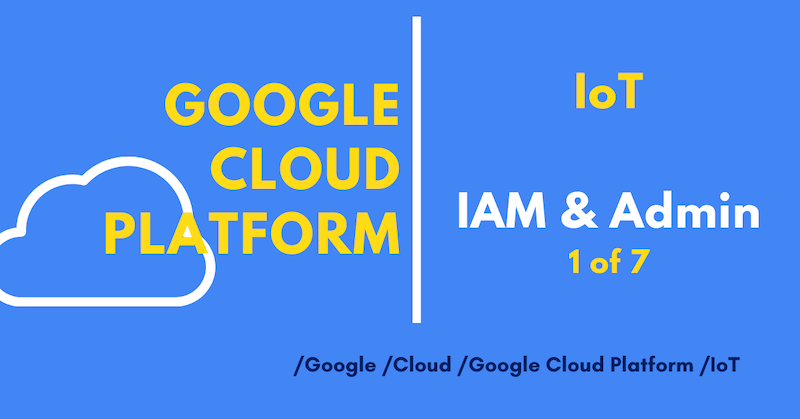](./GCP_IoT_Step1A.ipynb)

[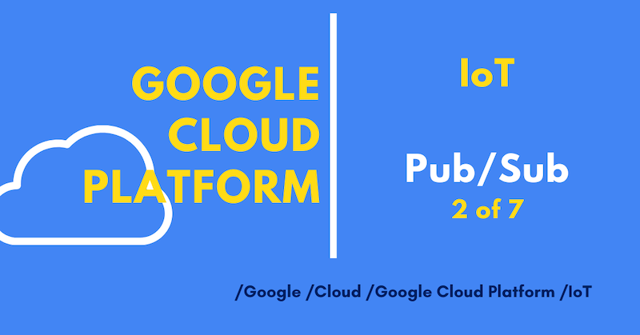](./GCP_IoT_Step1B.ipynb)

[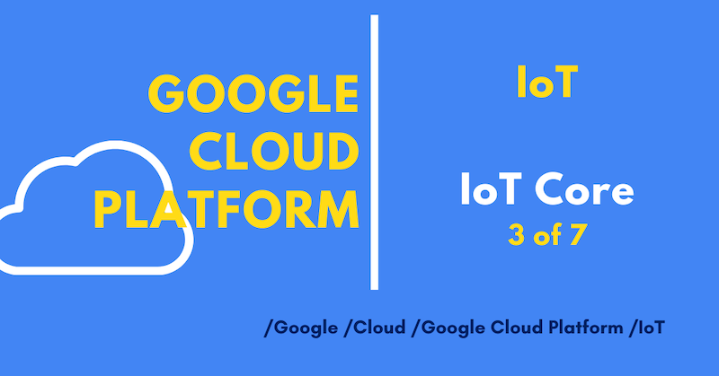](./GCP_IoT_Step1C.ipynb)

[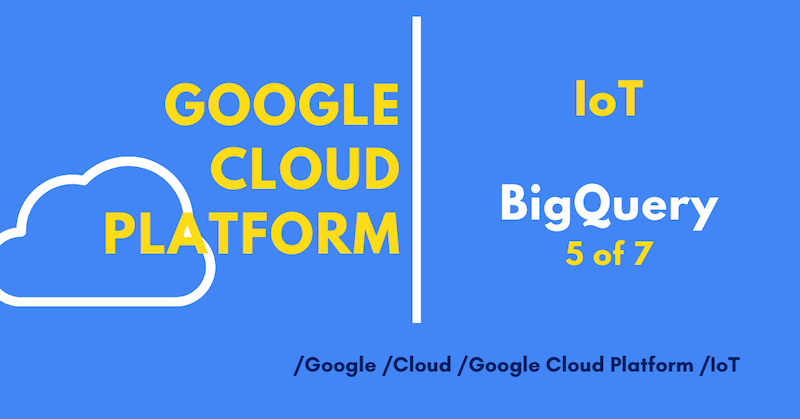](./GCP_IoT_Step1E.ipynb)

[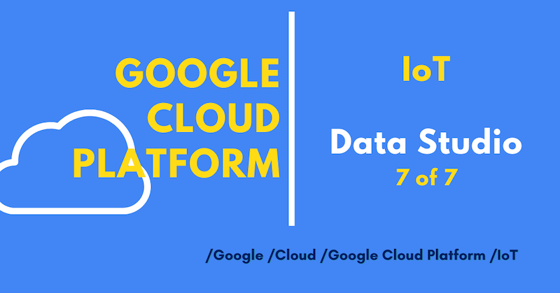](./GCP_IoT_Step1G.ipynb)

## Autonomous Car

[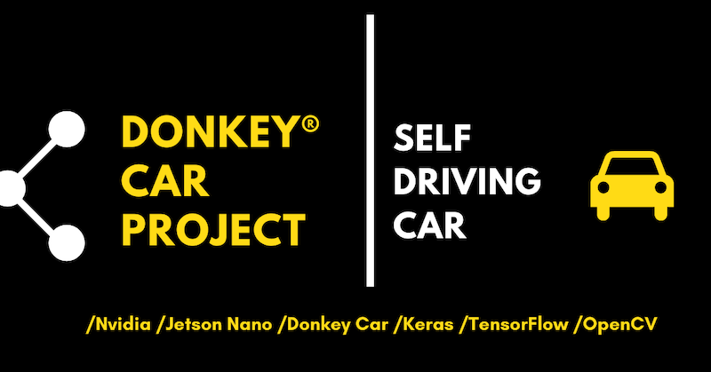](./Donkey_Car_Project.ipynb)

## Big Data

[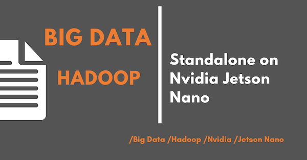](./BD_Hadoop_MapReduce.ipynb)

[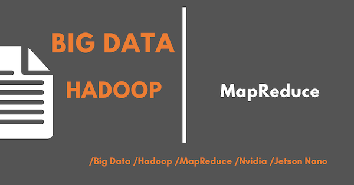](./BD_Hadoop_HDFS.ipynb)

[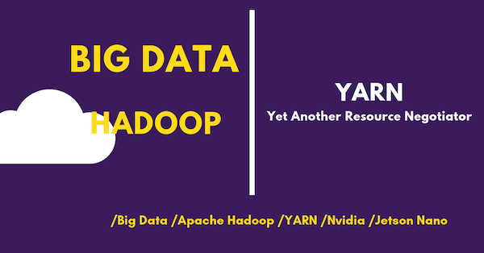](./BD_Hadoop_Yarn.ipynb)

[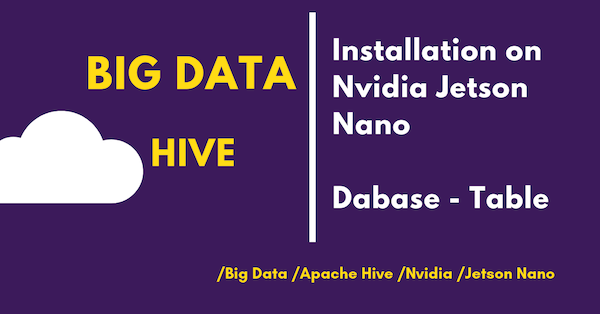](./BD_Hive.ipynb)

[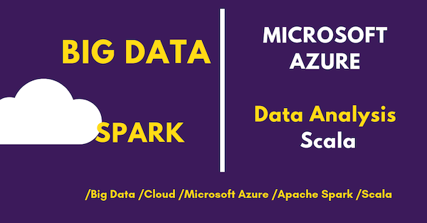](./BD_Azure_Spark.ipynb)

## Deep Learning

## Nvidia Jetson Nano

[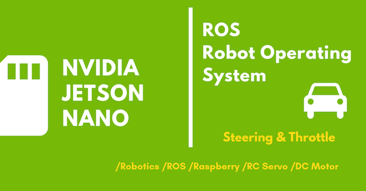](./ROS_RC_Car.ipynb)

## Data Science

## Machine Learning

## SAP

[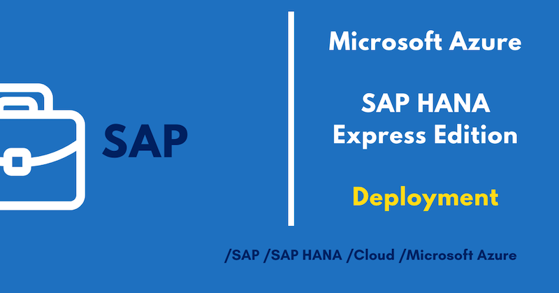](./SAP_Hana_Azure_A.ipynb)

[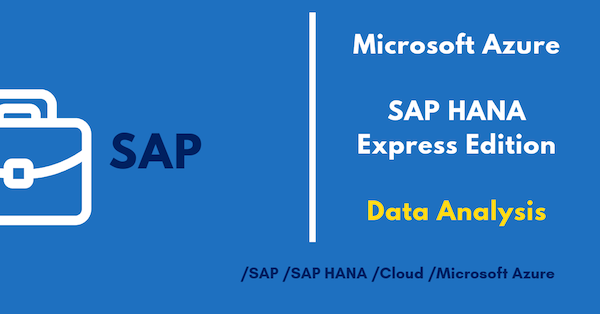](./SAP_Hana_Azure_B.ipynb)

## Hardware

### Nvidia Jetson Nano, Raspberry PI, Arduino, Camera & Sensors

