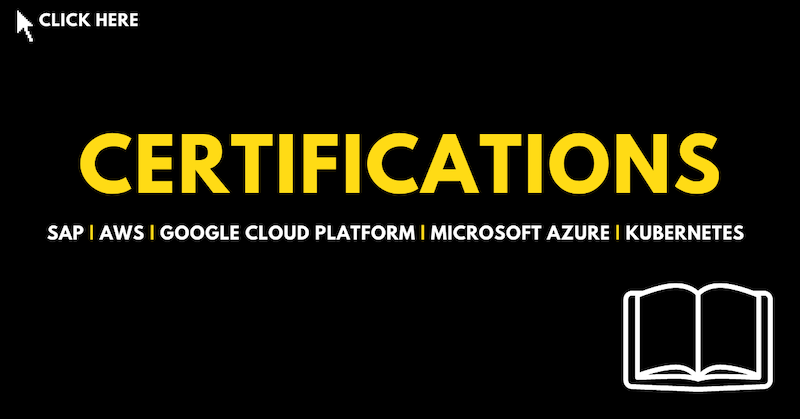
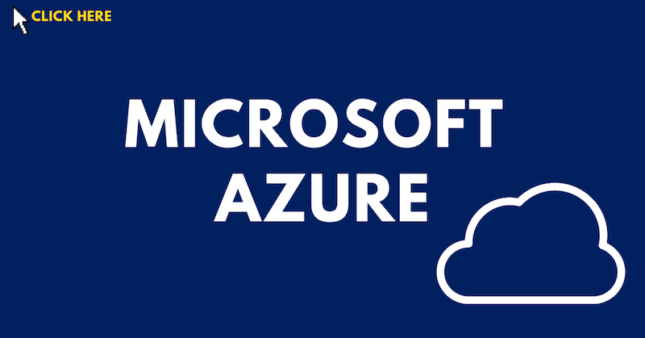
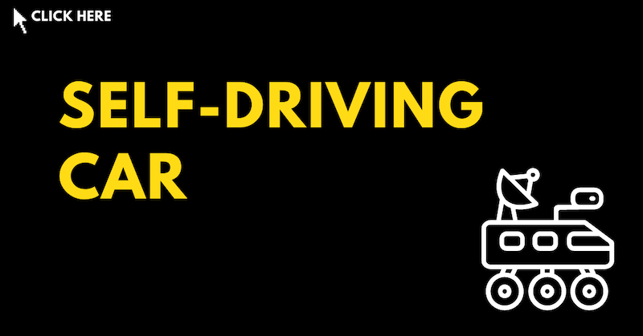
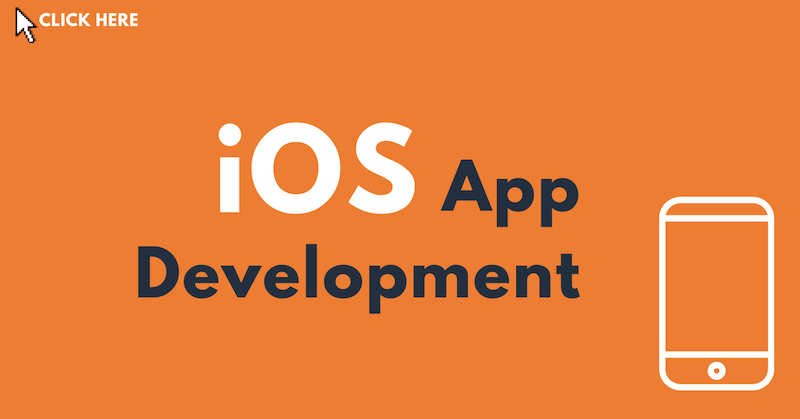
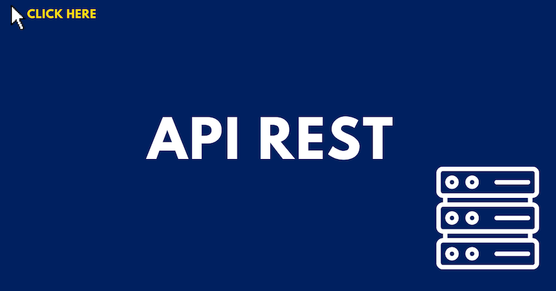
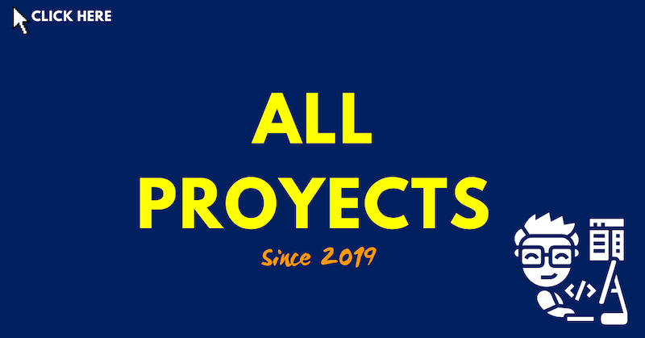

# Portfolio

https://github.com/edotfs/portfolio/assets/45471742/09bb0d3f-93e8-477f-9e6d-3dd98298f985

  <video src="https://github.com/edotfs/portfolio/assets/45471742/955156cc-0805-4726-949c-8bb82a9b5ef5" width="400" />
  <video src="https://github.com/edotfs/portfolio/assets/45471742/09bb0d3f-93e8-477f-9e6d-3dd98298f985" width="400" />

