# Portfolio

## Autonomous Car

[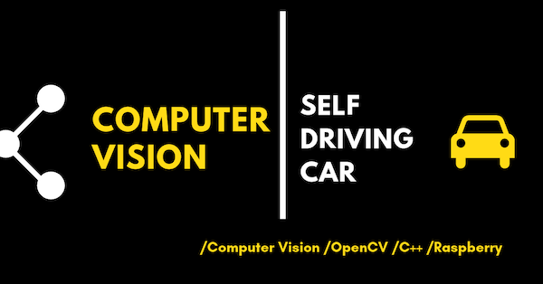](./CV_Self_Driving_Car.ipynb)

## Spark

[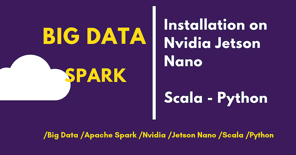](./Spark_Nvidia_Jetson_Nano.ipynb)

## Deep Learning

[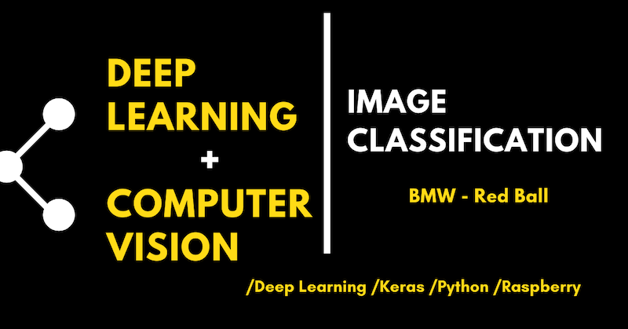](./DL_Image_Classification.ipynb)

## Nvidia Jetson Nano

[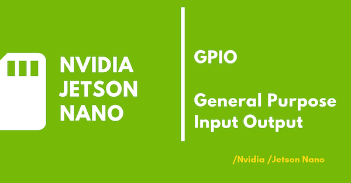](./Nvidia_Jetson_Nano_GPIO.ipynb)

## Data Science

[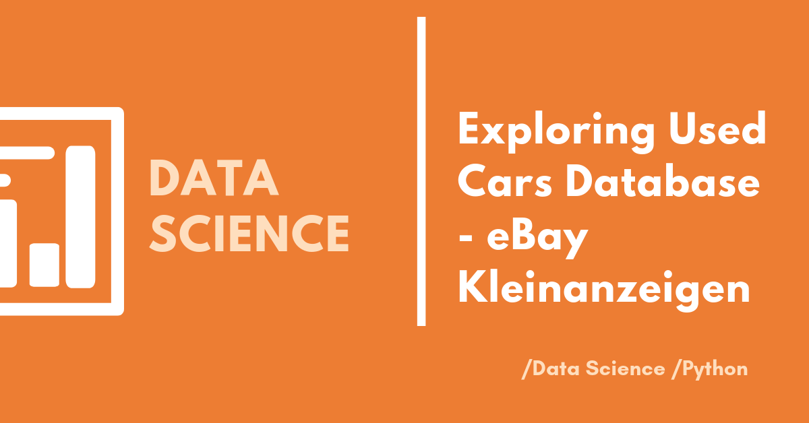](./DS_eBay_Kleinanzeigen.ipynb)

[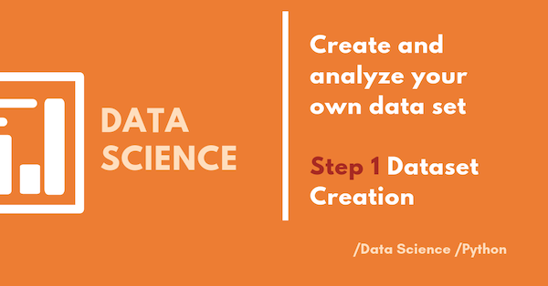](./DS_Dataset_Step1.ipynb)

[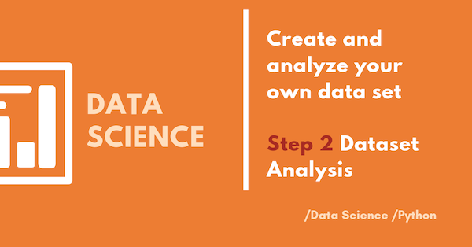](./DS_Dataset_Step2.ipynb)

[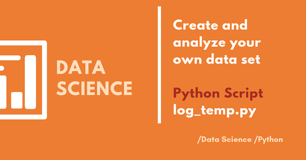](./log_temp.py)

[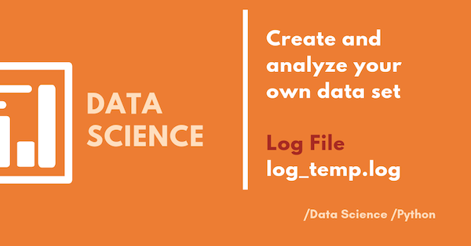](./log_temp.log)

## Machine Learning

[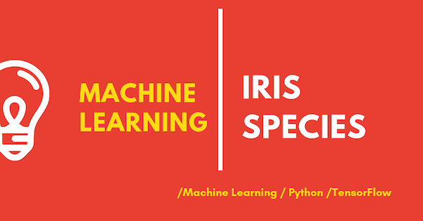](./ML_Tensorflow_Iris.ipynb)

[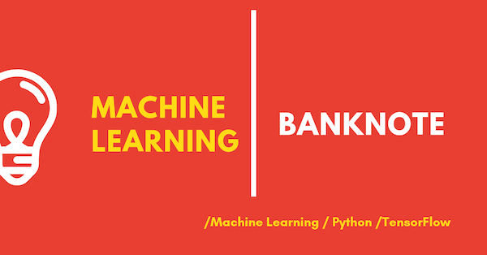](./ML_Banknote.ipynb)

[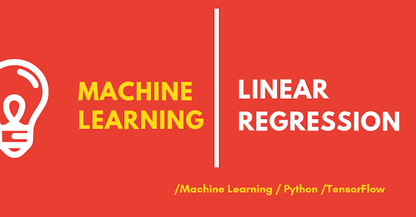](./ML_Linear_Regression.ipynb)

## SAP

[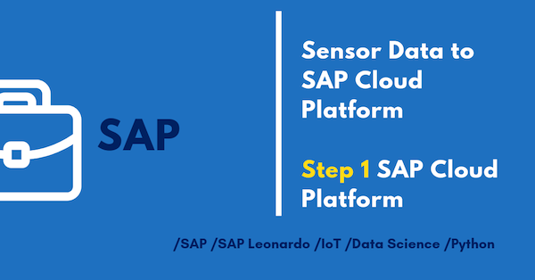](./SAP_HCP_Sensor_Step1.ipynb)

[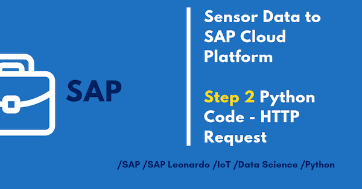](./SAP_HCP_Sensor_Step2.ipynb)

## Hardware

### Raspberry PI, Arduino & Sensors

