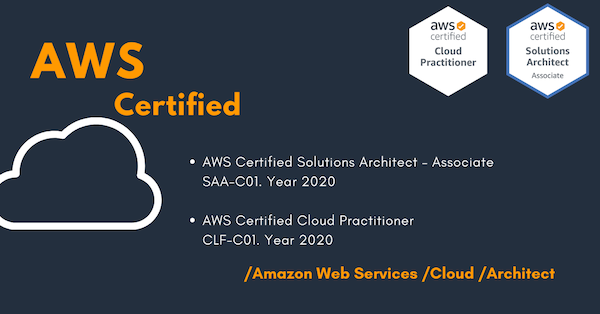

# Portfolio
## Cloud Certifications

## Amazon Web Services

## Google Cloud Platform

## Autonomous Car

## Deep Learning

## Data Science

## Machine Learning

## Big Data

## Nvidia Jetson Nano

## SAP

## Hardware

### Nvidia Jetson Nano, Raspberry PI, Arduino, Camera & Sensors

