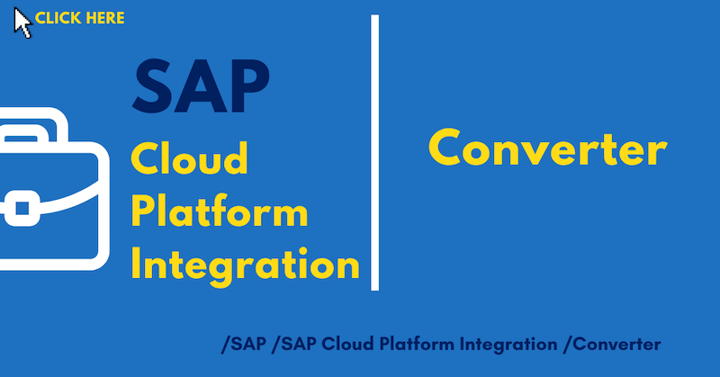
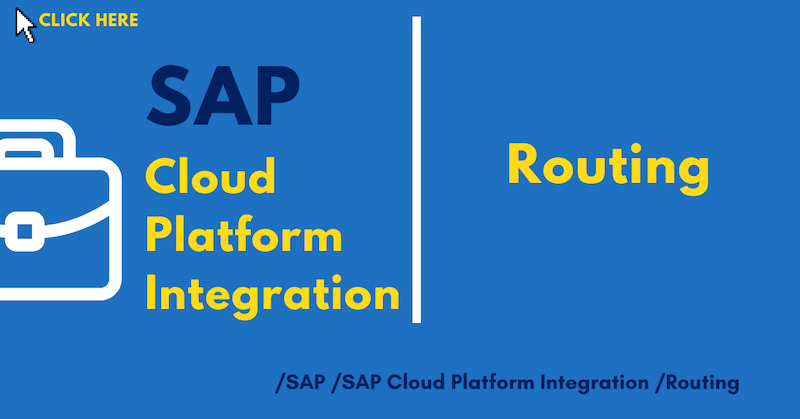
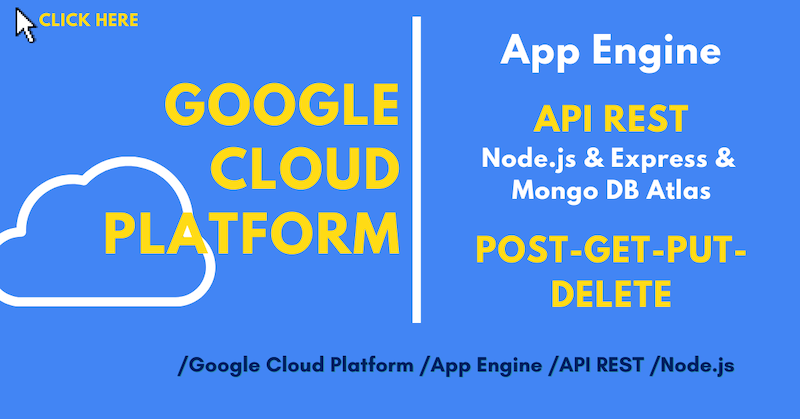
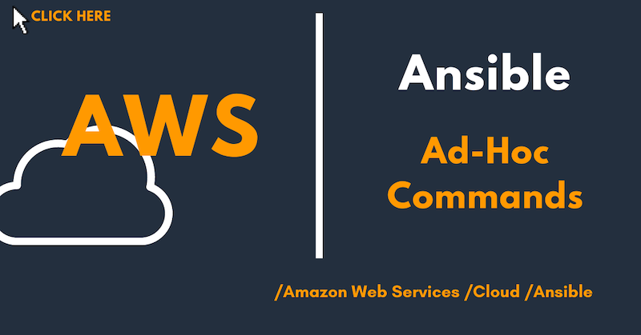

# Portfolio

## Certifications

## Google Cloud Platform - DevOps

## SAP Cloud Platform Integration

## Amazon Web Services - IoT

## REST API - GCP - AWS - On-Premise

## Google Cloud Platform - IoT

## SAP IoT

## Autonomous Car

## Google Cloud Platform - Machine Learning

## Deep Learning

## Machine Learning

## Data Science

## Terraform

## Ansible

## Microsoft Azure

## Nvidia Jetson Nano

## Big Data

## Hardware

### Nvidia Jetson Nano, Raspberry PI, Arduino, Camera & Sensors

