# Portfolio - SAP

## SAP Cloud Integration

[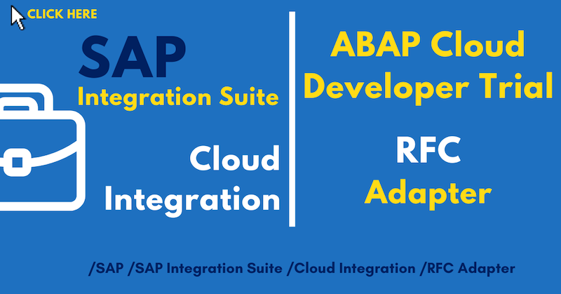](../jupyter_notebooks/SAP_CI_RFC.ipynb)

[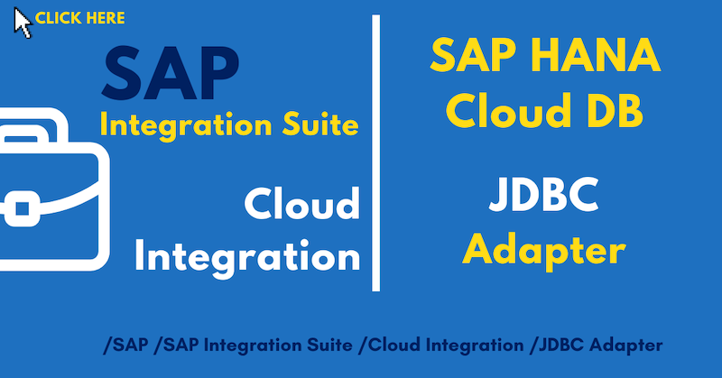](../jupyter_notebooks/SAP_CI_HANADB.ipynb)

[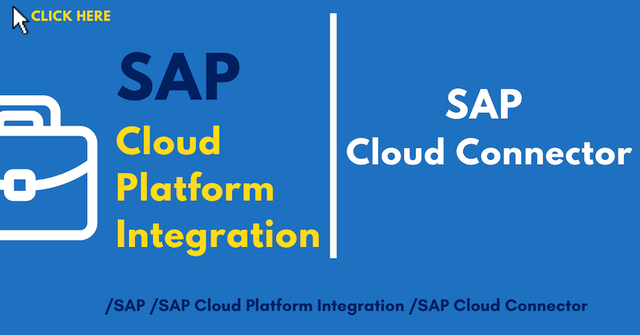](../jupyter_notebooks/SAP_CPI_CC.ipynb)

[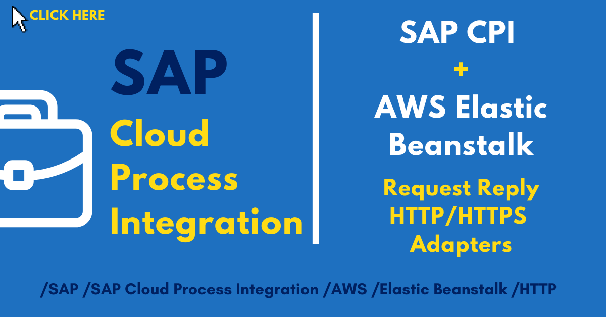](../jupyter_notebooks/SAP_CPI_API.ipynb)

[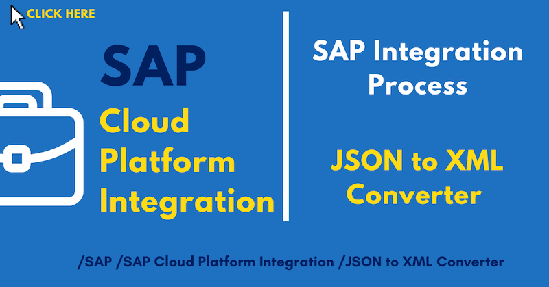](../jupyter_notebooks/SAP_CPI_Converter.ipynb)

[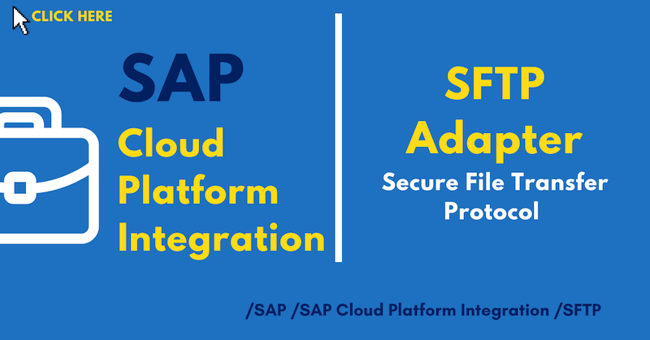](../jupyter_notebooks/SAP_CPI_SFTP.ipynb)

[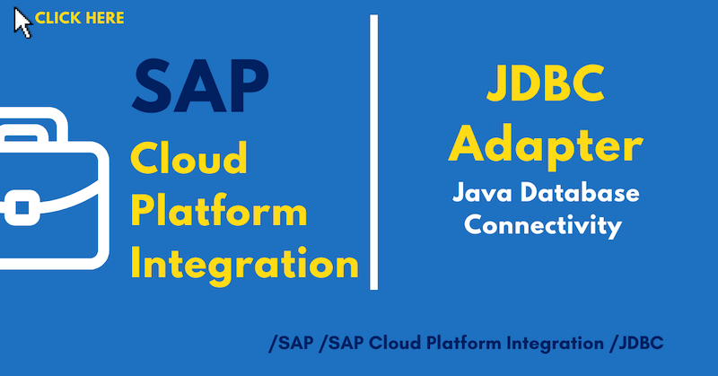](../jupyter_notebooks/SAP_CPI_JDBC.ipynb)

[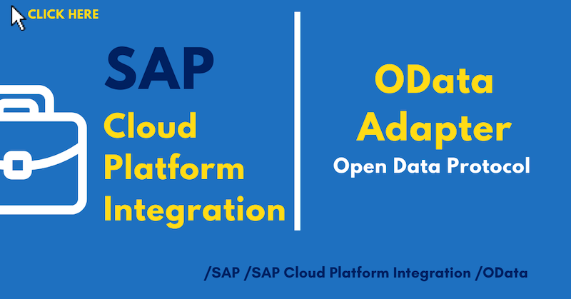](../jupyter_notebooks/SAP_CPI_ODATA.ipynb)

[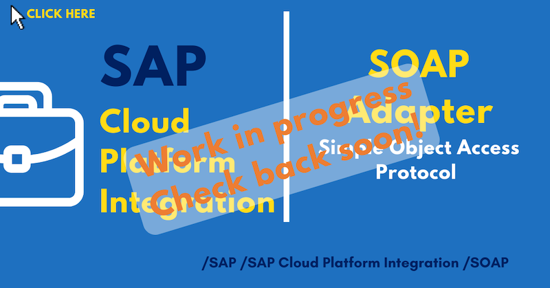](../jupyter_notebooks/SAP_CPI_SOAP.ipynb)

[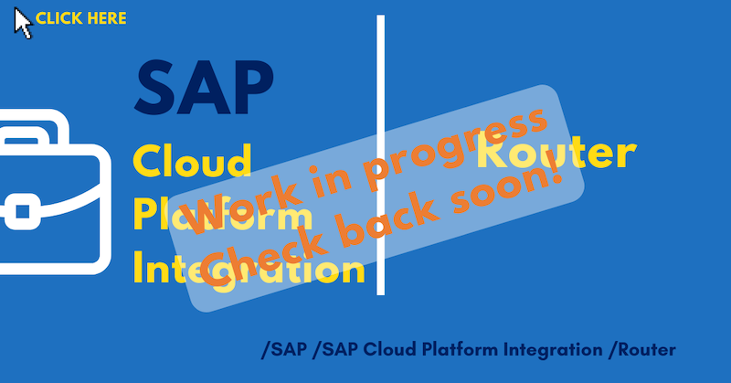](../jupyter_notebooks/SAP_CPI_Routing.ipynb)

[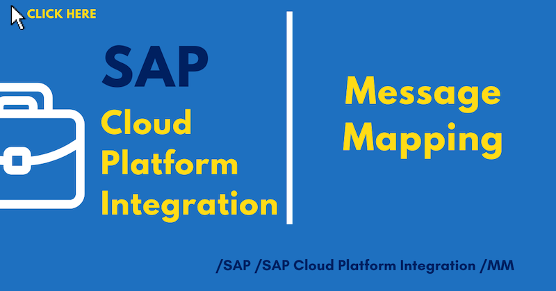](../jupyter_notebooks/SAP_CPI_MM.ipynb)

[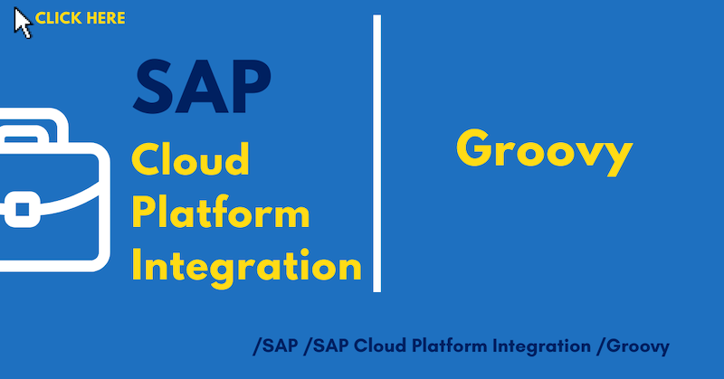](../jupyter_notebooks/SAP_CPI_Groovy.ipynb)

## SAP Process Orchestration 7.5

[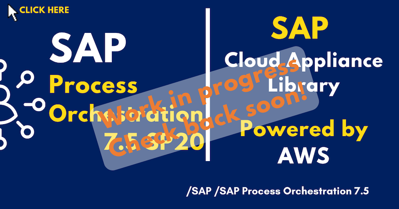](../jupyter_notebooks/SAP_PO_CAL.ipynb)

[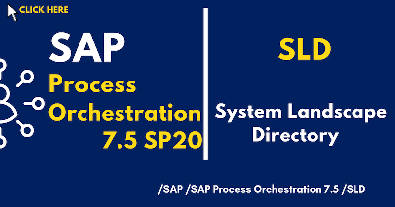](../jupyter_notebooks/SAP_PO_SLD.ipynb)

[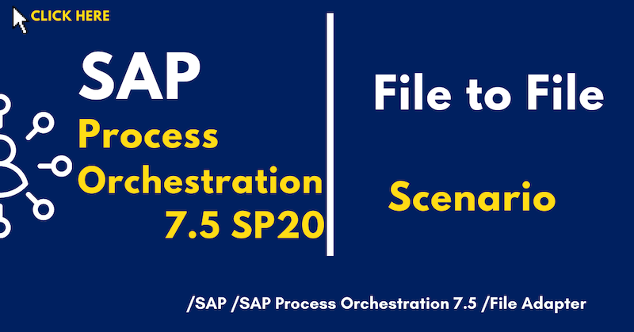](../jupyter_notebooks/SAP_PO_F2F.ipynb)

[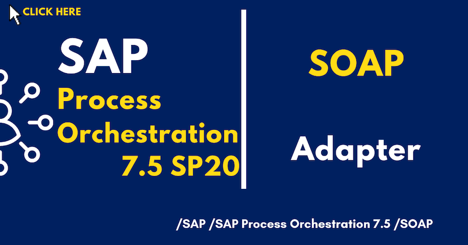](../jupyter_notebooks/SAP_PO_S2S.ipynb)

[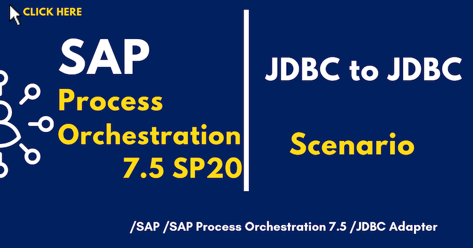](../jupyter_notebooks/SAP_PO_J2J.ipynb)

[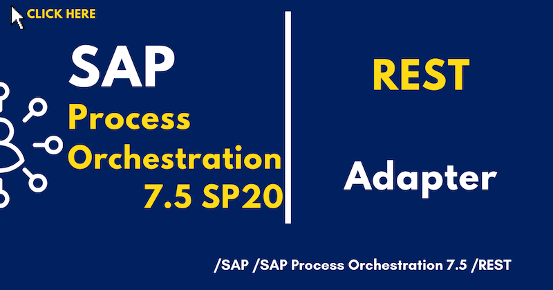](../jupyter_notebooks/SAP_PO_R2F.ipynb)

## SAP Business Technology Platform

[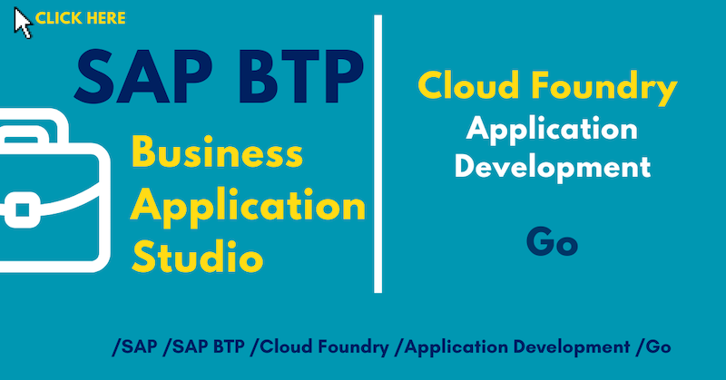](../jupyter_notebooks/SAP_BTP_Go.ipynb)

[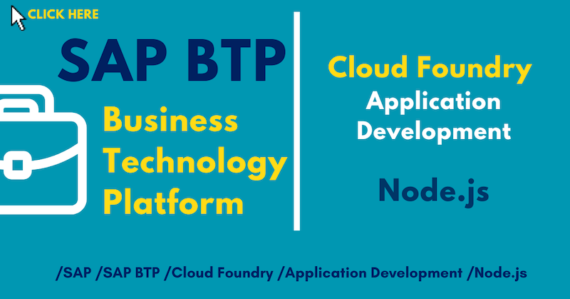](../jupyter_notebooks/SAP_BTP_Node.ipynb)

[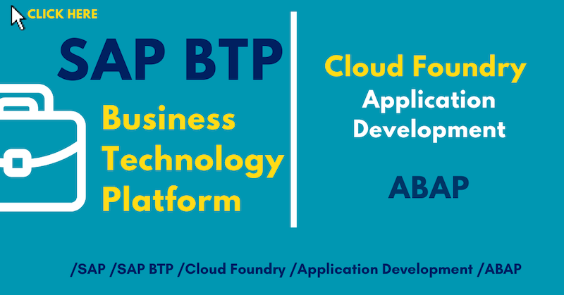](../jupyter_notebooks/SAP_BTP_ABAP.ipynb)

[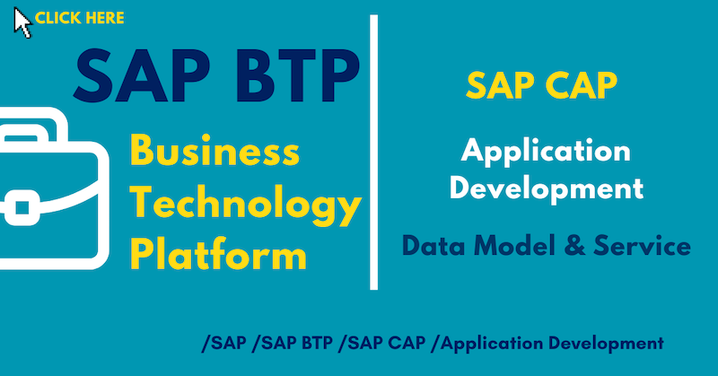](../jupyter_notebooks/SAP_BTP_CAP.ipynb)

[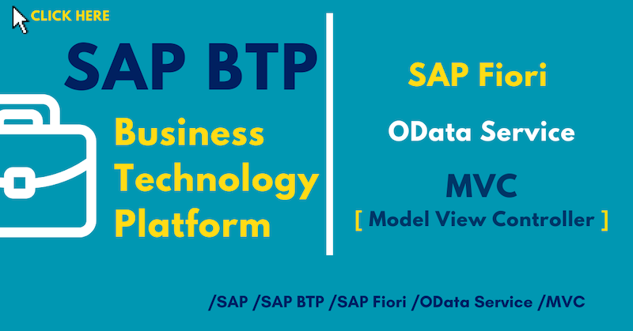](../jupyter_notebooks/SAP_BTP_Fiori.ipynb)

[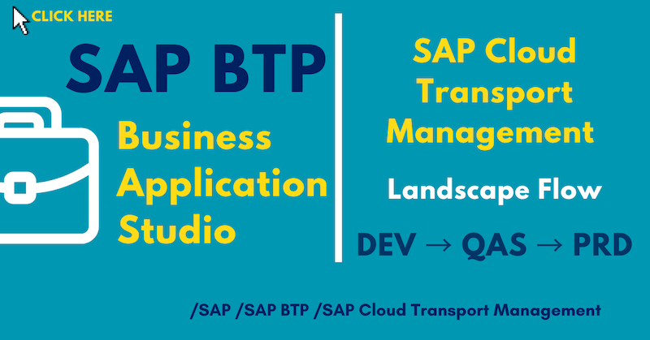](../jupyter_notebooks/SAP_BTP_CTM.ipynb)

[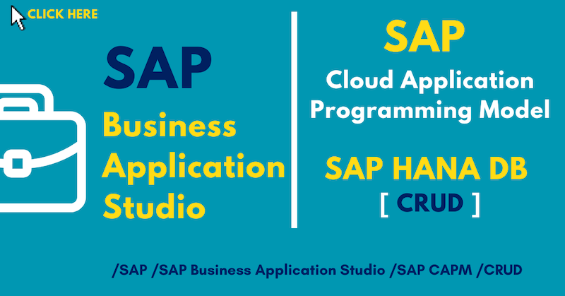](../jupyter_notebooks/SAP_BAS_CRUD.ipynb)

## SAP HANA

[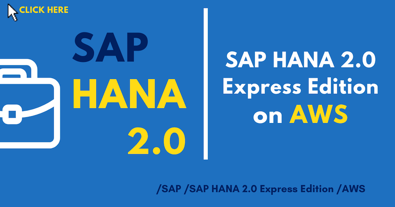](../jupyter_notebooks/SAP_HXE.ipynb)

## ABAP Platform Trial

[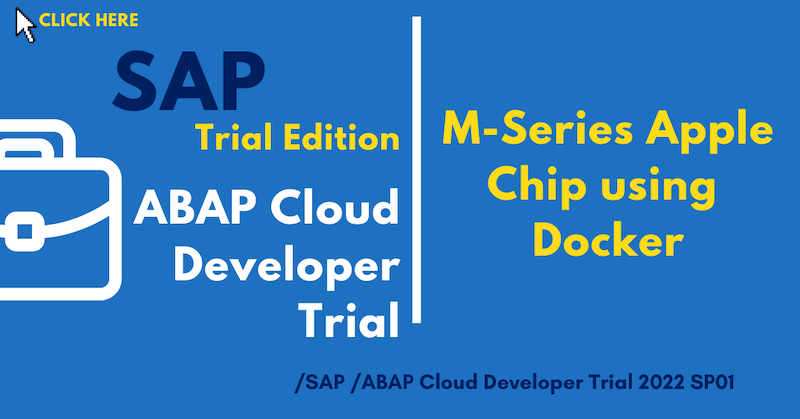](../jupyter_notebooks/SAP_CI_RFC.ipynb)

## SAP IoT

[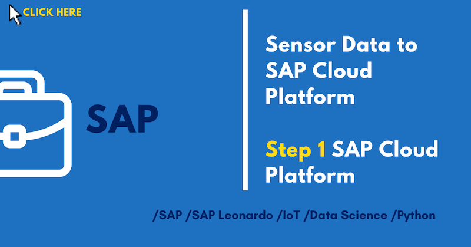](../jupyter_notebooks/SAP_HCP_Sensor_Step1.ipynb)

[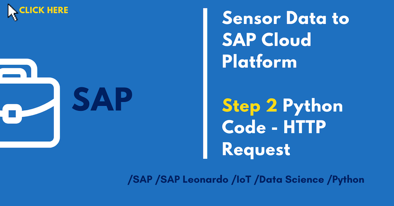](../jupyter_notebooks/SAP_HCP_Sensor_Step2.ipynb)

